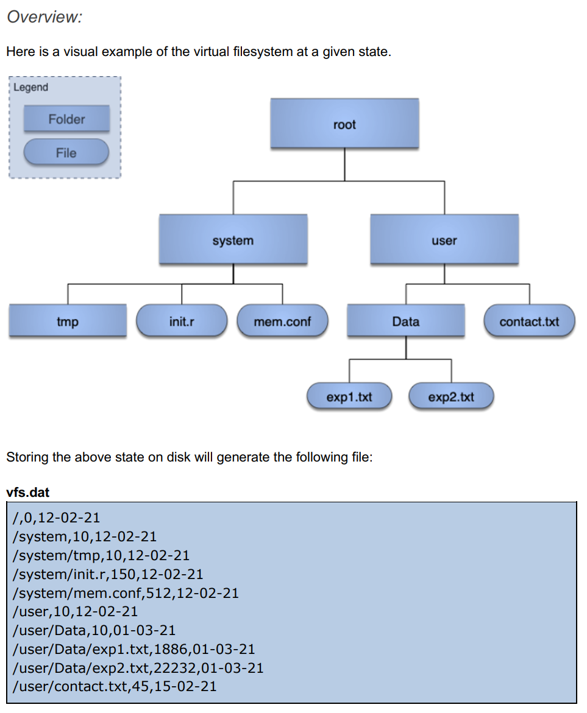
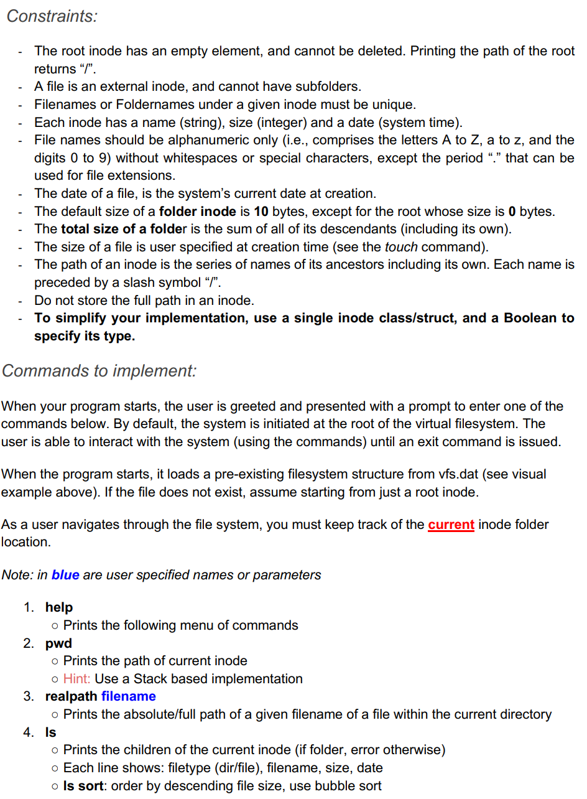
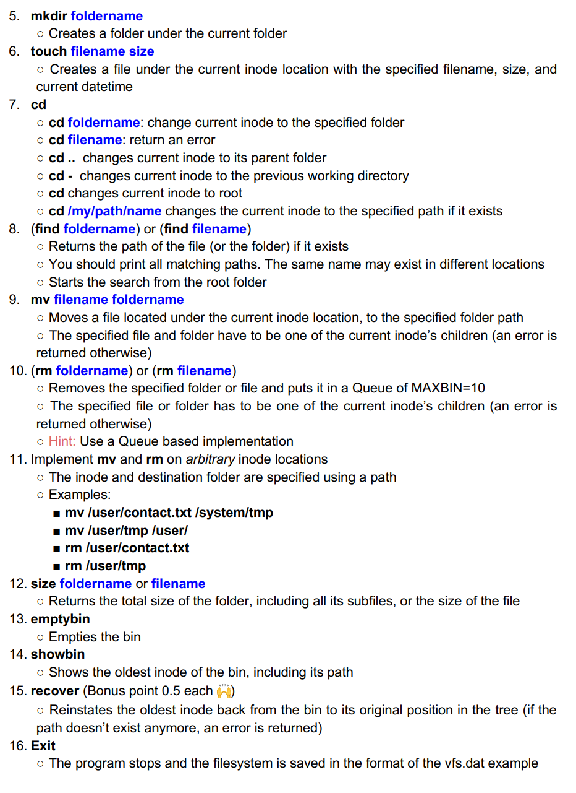
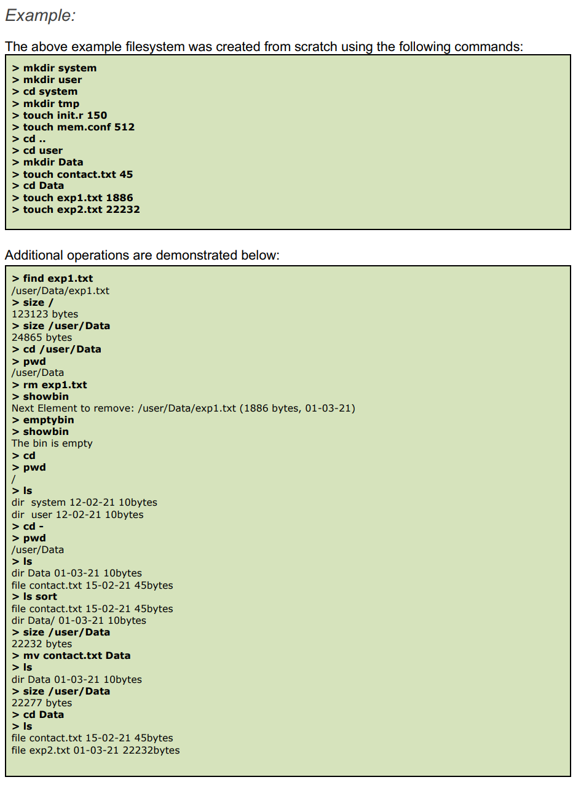

# Virtual-File-System

In this project, a virtual filesystem (VFS) is developed. A user can create/delete/move
folders and files, among other operations described below. The filesystem was  organized
as a Tree. Each inode[1](https://en.wikipedia.org/wiki/Inode) contains metadata about the node (e.g., file or folder, size, date). A folder
can have zero or many folders and files, while a file is considered as a leaf node only. Deleting a
file puts the inode’s element in a limited size queue (the Bin/Trash) which can be emptied
manually or automatically. The interface allows a user to navigate and perform the
described tasks below. At the beginning and end of the session, the file system is loaded, and
dumped to the disk, respectively.
Object-oriented programming (OOP) principles will be used 
and appropriate data structures. 

